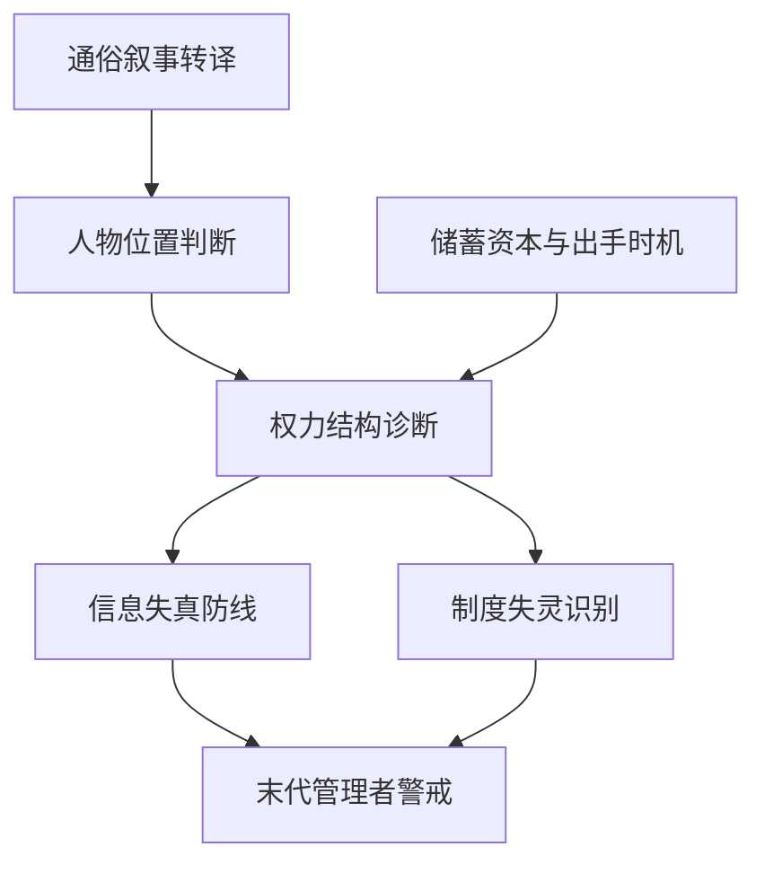

# 《明朝那些事儿》仓颉 skill 索引

## 来源

- 作者: 当年明月
- 源文本来自用户放入的 EPUB, 已抽取到 `source/book.txt`。
- 产出: 7 个可独立调用的 Codex skill。

## Skill 清单

| skill | 中文名 | 适用场景 |
|---|---|---|
| `actor-position-analysis` | 人物位置判断 | 用户评价一个领导者、同事、历史人物或组织角色时使用：先看位置、资源、约束、对手和目标，再做人品或能力判断。 |
| `power-structure-diagnosis` | 权力结构诊断 | 用户想弄清组织里谁能推动或阻止事情时使用：拆分名义权力、信息入口、执行权、否决权和联盟。 |
| `timing-reserve-action` | 储蓄资本与出手时机 | 用户犹豫是否立刻推动变革、谈判、转型或关键行动时使用：先检查资源、合法性、盟友、窗口和失败代价。 |
| `institution-failure-diagnosis` | 制度失灵识别 | 用户发现团队或公司反复出现同类问题时使用：检查激励、流程、监督、例外权和退出机制，而不是只换人。 |
| `information-distortion-defense` | 信息失真防线 | 管理者担心听到的信息被过滤、讨好或扭曲时使用：建立反向渠道、独立样本、异议保护和事实复盘。 |
| `late-stage-leader-warning` | 末代管理者警戒 | 用户处在烂摊子、危机后期或高压管理位置时使用：识别猜疑、频繁换人、急于翻盘导致的二次损失。 |
| `popular-history-translation` | 通俗叙事转译 | 用户要把复杂历史、业务或知识写成普通人能懂的内容时使用：用人物线和因果线降低门槛，同时保留史料或事实边界。 |

## 调用关系

## 使用边界

- 这些 skill 来自整书方法论蒸馏, 适合用于决策、写作、管理和自我整理场景。
- 它们不是原书摘要, 也不替代阅读原书。
- 当用户只是想查事实、考据版本或要原文出处时, 应先回到源文本或可靠资料。
